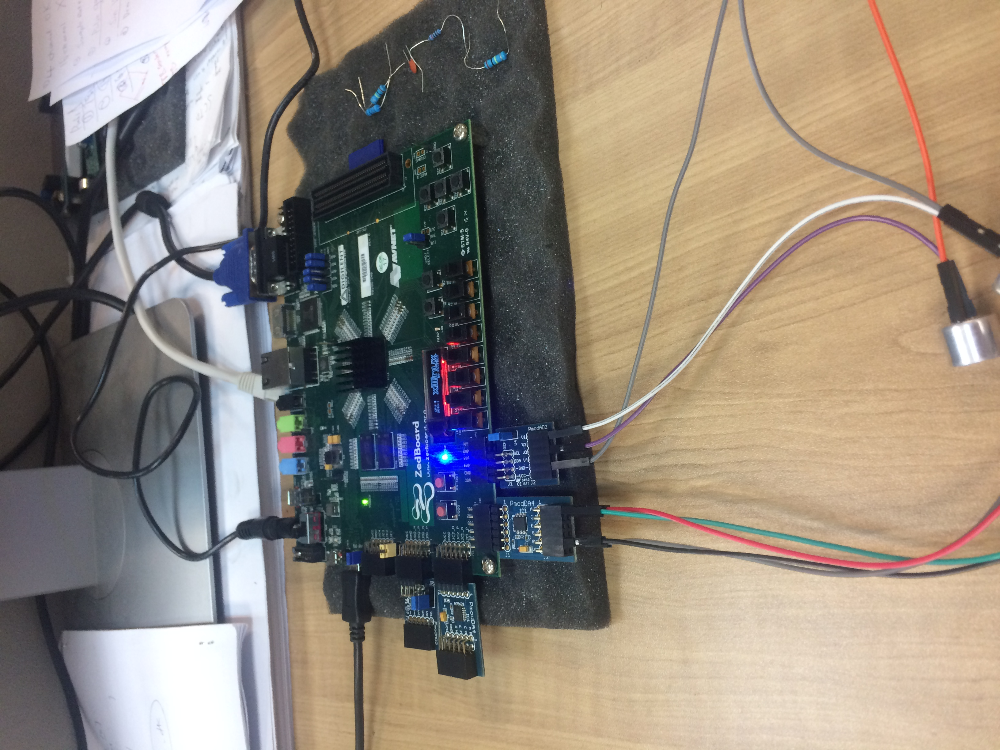
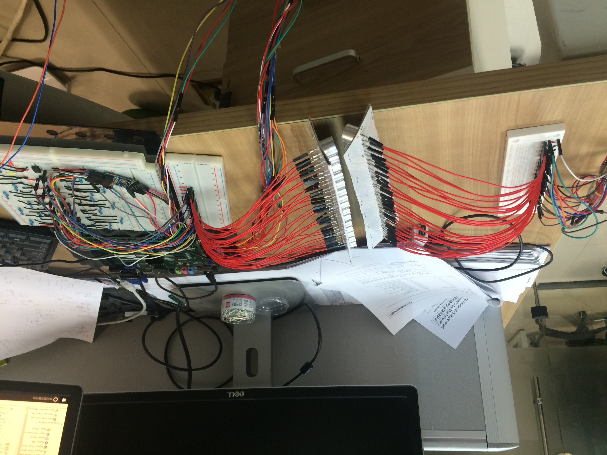
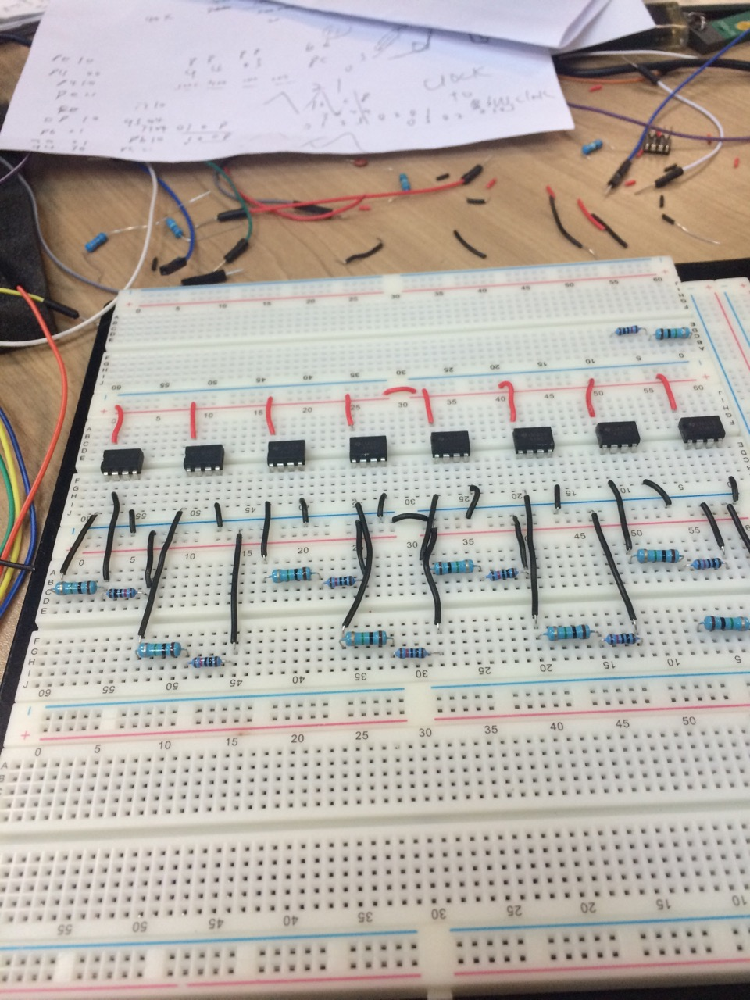
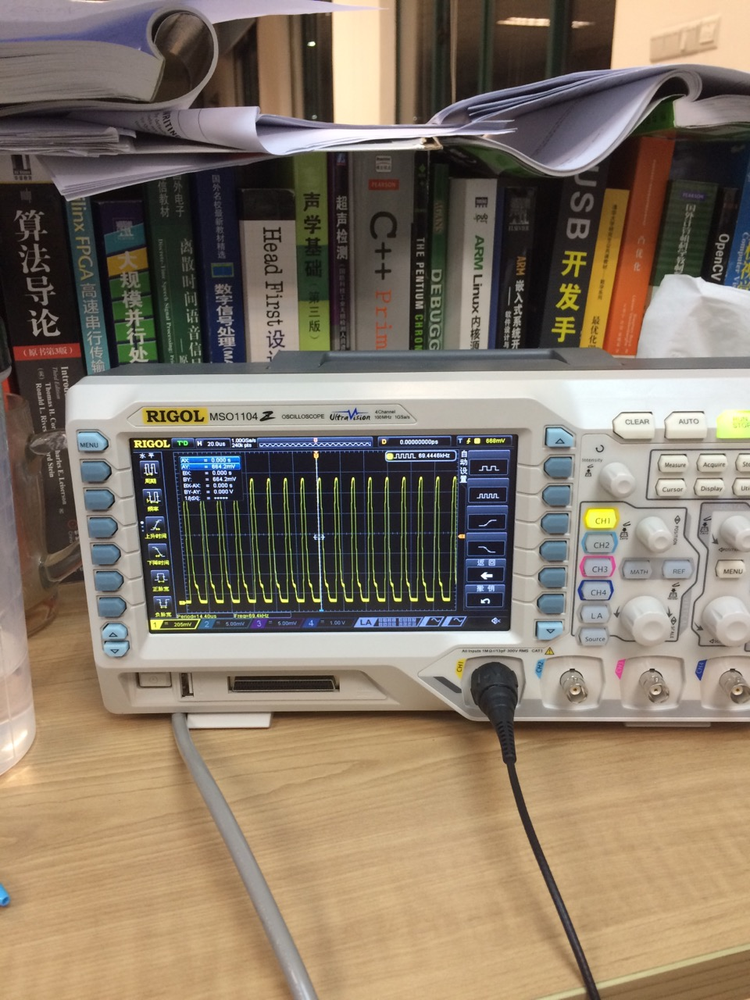
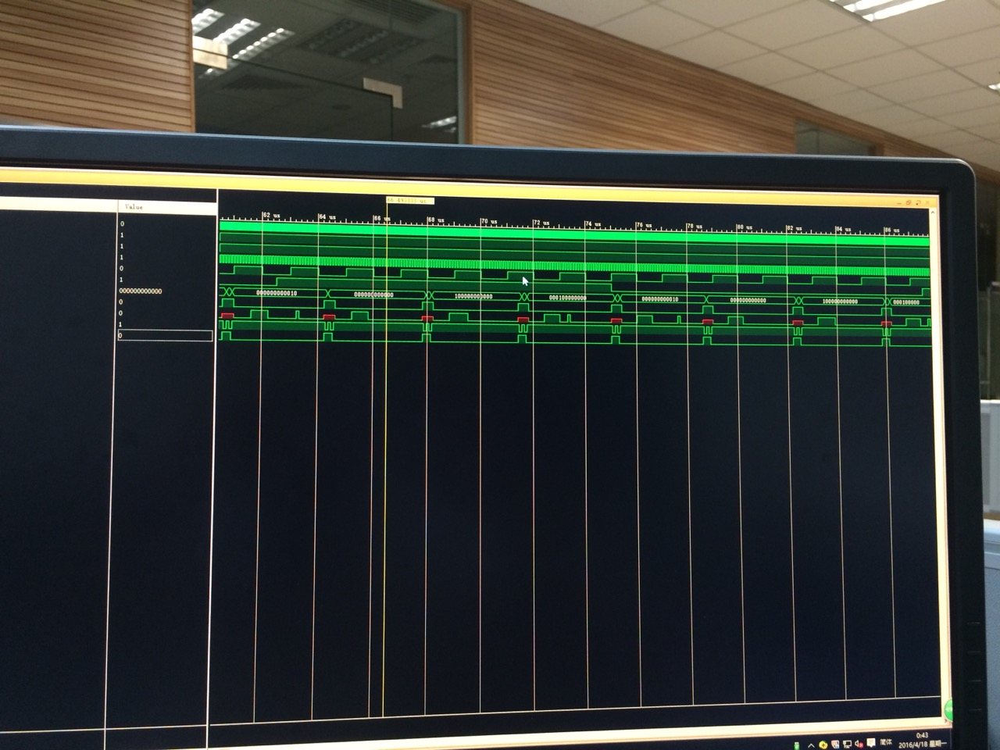
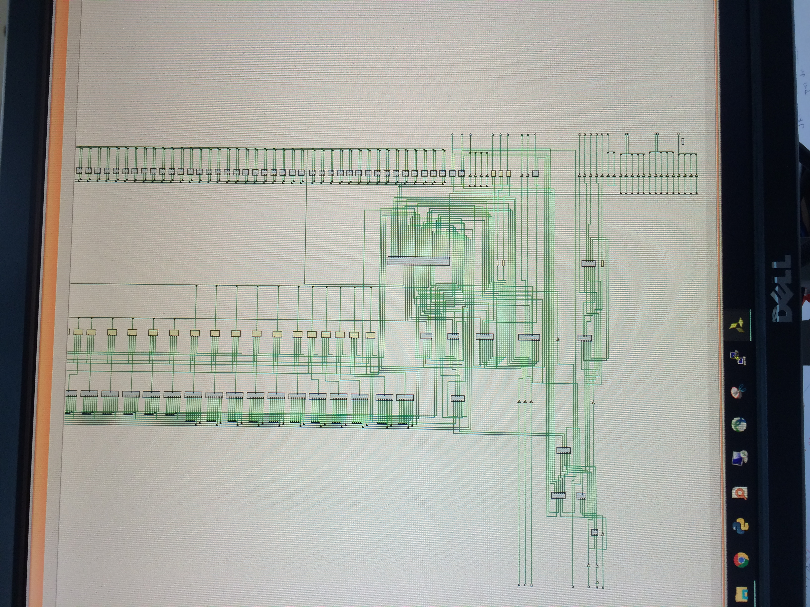
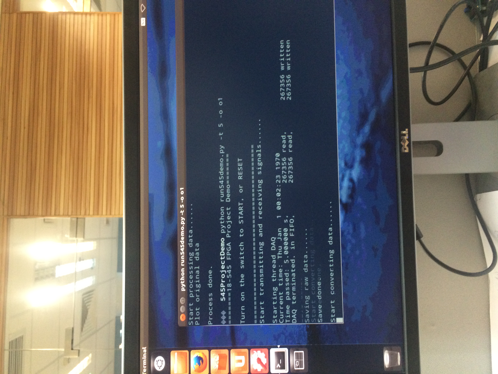
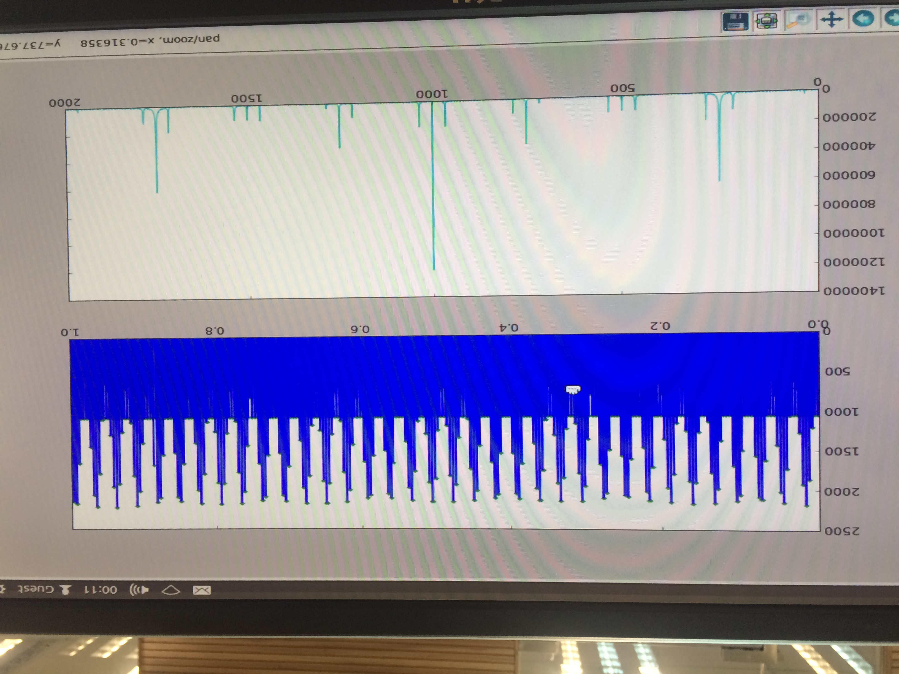
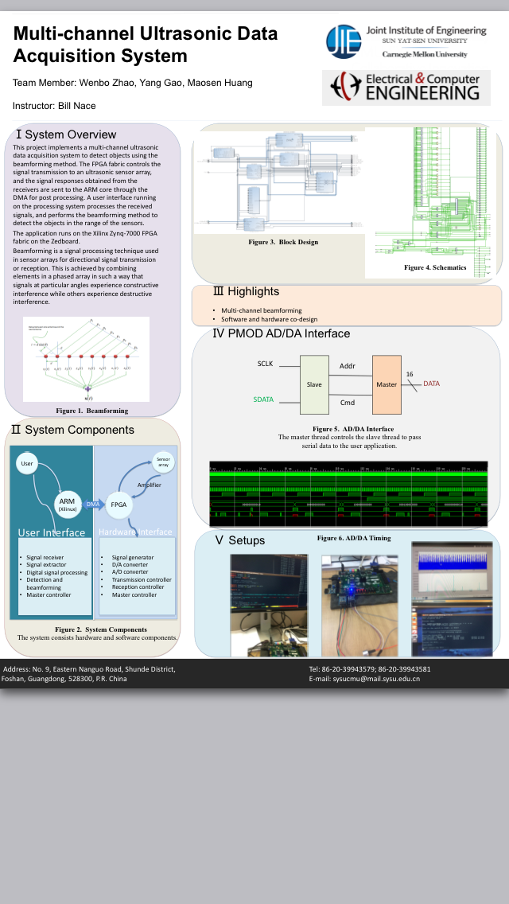

# 18545-FPGA_Ultrasound-DAQ-Beamforming

Repo for CMU 18545 FPGA project -- Multi-channel ultrasound data acquisition and beamforming system.

This repo documents the CMU course project -- 18545 Advanced Digital Design Project.
>
- Project Overview
- Pre-Preparation
- Usage Tutorial
- Design Components In-Depth Instructions
- Conclusion and Future Work
- Acknowledgement
- Bugs Report and Trouble Shooting
- Some Photos

-----

## 1. Project Overview
This project aims to detect the static and moving objects in the room and implement
the imaging with the beamforming algorithm running on the AVNET &reg; ZedBoard.

### Motivation
Since this is a logic design and verification course, maybe the best practice is to
perform all the functionalities on the FPGA fabric. But we decide to take the dual-core
advantage of the ZedBoard, implementing the signal transmission and reception part on
the fabric, and the signal process and analysis on the Linux host on the ARM core. This
also gives us the benefit of easily customizing the user interface functionality with
the user demands, and in the meanwhile keeping the high efficiency parallel computing
with the FPGA.

### Framework
The design consists of both hardware design and software design, *aka.*, the software-
hardware co-design. The hardware design are the signal transmission and reception logic,
including the signal generator, the DAC/ADC interface, the data processor, as well as the
master controller. The software design are the signal process and analysis procedures,
including the data acquisition controller, the digital signal processor, as well as the
beamformer.

## 2. Pre-Preparation
Before working on this design, you need a few prerequisites to get started.

### Get the board! ...and the hard/soft/misc essentials
What you need are
 1. A ZedBoard, with a Zynq-7000 FPGA fabric and a dual-core ARM processor. Although it
 is possible to use a different board, changes need to be made accordingly.
 2. Two PMOD DA4 and four PMOD AD2. Or other ADC/DAC parts you prefer.
 3. Two arrays of ultrasonic transcivers. I use two home-made linear arrays with 16 elments each,
 each element having the operating frequency at 40 KHz.
 4. An amplifier to amplify the output voltage. I use eight LM351 Op Amps to make a
 simple 16-channel non-inverting amplifier with 100 times gain.
 5. A monitor to display, a USB keyboard, a USB mouse, a USB hub.
 6. A breadboard and a lot of wires. I know how these stuff get things messy...

### Get the Xillybus IP core and the Xillinux ready
In this part, you need to compile and implement the Xillybus IP core that will be running on the
FPGA fabric (Programming Logic, PL), and install the Xillinux package on the ARM core (
Processing System, PS).

Please follow these steps

1. Go to [this link](http://xillybus.com/xillinux "xillybus") and download the necessary
packages and tools.
2. Carefully follow [this link](http://xillybus.com/downloads/doc/xillybus_getting_started_zynq.pdf)
to setup the Xillinux and the Xillybus. It's lenthy, but pay attention to the *third*
chapter to properly generate the bitstream file, configure the board and load up the
booting image to the SD card. After this step, you should be able to boot up the
Xillinux from the SD card.
> **Note:** After this step, you are **Unable** to directly write the bitstream file to
> the PL via JTAG. Instead, copy and replace your custom bitstream file to the SD card
> with the same filename "xillydemo.bit".

3. Configure the compilation environment. Since Xillinux is essentially the Ubuntu kernel,
you can configure the environment as you prefer. I always use the [*oh-my-zsh*](
http://ohmyz.sh/) and the [*k-vim*](https://github.com/wklken/k-vim).

## 3. Usage Tutorial
Now you are ready to probe the system. In this step, you need to get yourself familiar
with the FPGA logic programming and the host programming.

Please refer to the following tutorials

1. [Xillybus FPGA designer's guide](http://xillybus.com/downloads/doc/xillybus_fpga_api.pdf)
2. [Xillybus host application programming guide for Linux](http://xillybus.com/downloads/doc/xillybus_host_programming_guide_linux.pdf)
3. [The guide to defining a custom Xillybus IP core](http://xillybus.com/downloads/doc/xillybus_custom_ip.pdf)

> **Note:** You should be familiar with the SystemVerilog language as I use it, and knows
> the basics of Verilog and VHDL. Specifically, you should know

> 1. Design hierarchy. The design under test (dut), the testbench, the top.
> 2. Combinational logic and sequential logic. The "assigns" and "always_combs", the
> explicit and implicit finite state machines.
> 3. The **VERY** important time synchronization. Good timing is the key to accurate and
> efficient logic.
> 4. FSM-Datapath.
> 5. Interface.
> 6. and most importantly, Testbenches. Knowing how to write a good testbench for hardware
> threads, concurrent threads, use assertions are vital for a decent logic design.

### Connect the wires
Connect the AD/DA modules, the transcivers, the amplifier, maybe an oscilliscope, and of
course, the power.

### Implement the user logic
The entire project can be found [here](http://pan.baidu.com/s/1dFlrVhf).

Run the project under *verilog/vivado/xillydemo.xpr* to generate the bitstream file, and
put it to the SD card.

### Run the demo script
Boot up the Xillinux and run the Python script under *host_script/run545demo.py*.

You should be able to receive the signals from the sensors and perform analysis.

## 4. Design Components In-Depth Instructions
In this section, I will walk you through the details in each
design module and the host script.

> **System** **flowchart:** Signal generator --> Pmod DA4 --> Transmitter array

> Receiver array --> Pmod AD2 --> Data processor --> Xilly reader --> FIFO -->
> Host process

### Signal reception interface
The *ad_rcv_intfc* collects all the signals in the data transmission and reception flow,
interfacing among the signal generator, the DA and AD, the data processor, the xilly
reader, the fifo, the master controller to arduously control the logic.

### Signal generator
The signal generator generates a 40 KHz continuous sine wave. Feel free to replace it
with your custom signal source. Although there are many approaches to this purpose,
*e.g.* PWM, DDS, CORDIC, to name a few, I use a 39-value look-up table with 12 bits
resolution to approximate the sine wave. It turns to be a fairly good approximation.
The reason to use 39 values is that after calculation I find this gives me an integer
divisor of 2 to divide the 100 MHz on-board clock in order to generate the 40 KHz signal.

On the arrival of the *sig_gen_en* signal from the top level, it addresses *start_gen*
and shift from *idleSt* to *genSt*. It uses a counter to count the number of values it
has sent out. It acknowledges the *sig_out_rdy* after sending done and waits for the
*da_send_done* from the DA4 module before proceeding to the next generation. Default
state is the *idleSt*. Reset brings it to the *idleSt*.

### DA interface
The pmodDA4 module interfaces with the Pmod DA4 hardware part to convert the signals from
the signal generator to analog outputs. Please refer [this link](http://www.analog.com/media/en/technical-documentation/data-sheets/AD5628_5648_5668.pdf) to see the protocals
interfacing with the part.

The module takes in a 12 bits signal each time, and sends out a 32 bits data sequence
in serial in 32 clock cycles. The 32 bits sequence consists
the command, the address, the signal, and the don't-care bits. The FSM has five states.
At the power on the idle state transits to *stInternalRef* and then *stRefTx* to set the internal
reference for the DA4 part, as required by the manual. It waits at the *stInit* until
the arrival of the *sig_out_rdy* signal, and proceeds to the *stTx* to send out the data.
It then addresses the *da_send_done* signal to interface with the signal generator to
start next signal generation.

### AD interface
The slave pmodAD2_ctrl module and the master TWICtl module interface with the Pmod AD2 hardware part to
convert the analog signals to digital signals.

Please refer [this link](http://www.analog.com/media/en/technical-documentation/data-sheets/AD7991_7995_7999.pdf) to see the protocals
interfacing with the part. It's a little bit complex to handle...

### Data processor
The ad_processor module loads 4 bytes of data from AD2 each time, and signals the xilly
reader to pass the data to the 32*512 fifo.

The initial purpose of this module is to perform basic windowing and filtering on the
raw data, but, well, you know, time presses...

### Xilly reader
This module controls the data follow to the fifo, see [Xillybus FPGA designer's guide](http://xillybus.com/downloads/doc/xillybus_fpga_api.pdf).

### Master controller
As its name states, this is the top module connecting all the submodules and interfacing
with the physical world. This module initializes the wires and registers and submodules.

### Other modules
Clock divider, divide the clocks.

Ad_2_fifo_sender, master control commands to start up the system.

### Host script
This Python script first starts the data acquisition for a user defined period of time,
and then decodes the channel and data information from the received data. Afterwards, it
processes the data and analyzes the data with user defined algorithm.

Three threads cooperate to do the task. Multithreading is useful here to leverage the
bottleneck of data transmission throughput between the PL and the PS, and the speed limit
of the PS. Pipelined scheme is preferred.

## 5. Conclusion and Future Work
This concludes the entire design of the ultrasound DAQ and beamforming system.

Future work

1. Fix bugs.
2. DSP on PL.
3. Enrich the signal generator vault.
4. Seperate control of signal transmission and reception.
5. The doppler and beamforming algorithms.

## 6. Acknowledgement
I would like to extend my great gratitude to all the people that support and help me
with this project. Special thanks go to Prof. Bill Nace in CMU.

## 7. Bugs Report and Trouble Shooting
1. Large detection range requires high power output.
2. Signal distortion after amplifying.
3. Pay attention to the input and output order of the FIFO.
4. Pay attention to the default case and reset case. Make them safe.
5. Pay attention to the holding signals and temporal signals.
6. Pay attention to the cross time domain synchronization.
7. Pay attention to the usage of x or z.
8. Fake connect the GPIOs to FMC pins in the XDC file.

## 8. Some photos

